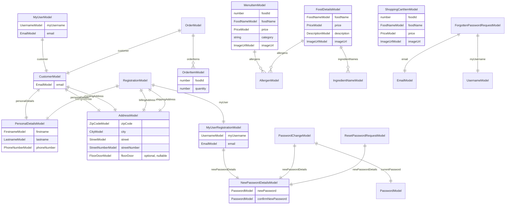
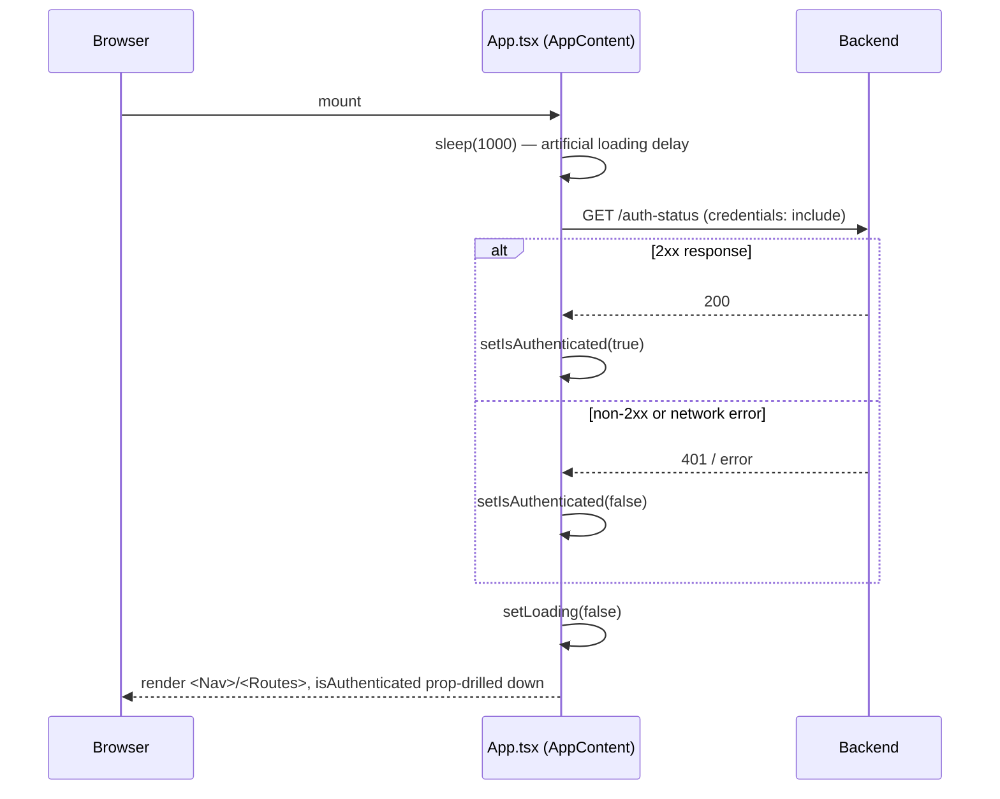
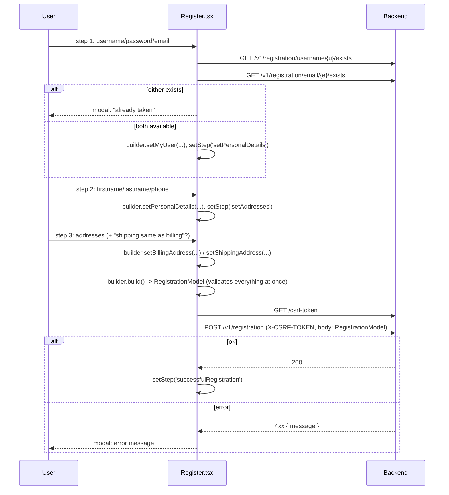
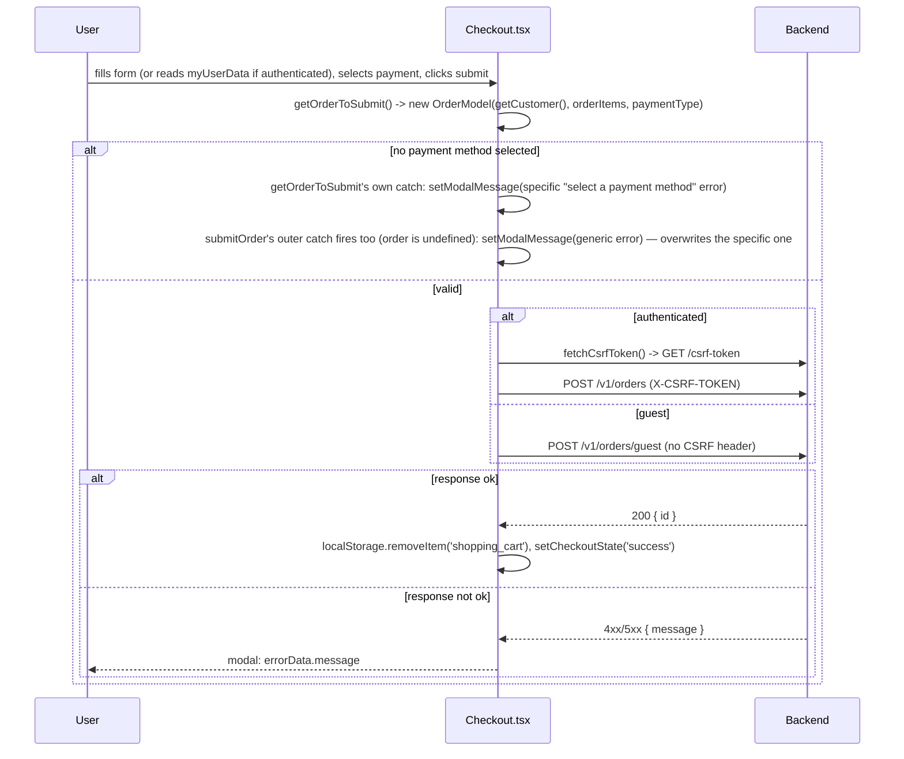

# Design Description — reference-react-typescript

## 1. Overview & Purpose

This document explains how this codebase is built and *why*, for an engineer who already knows
(from `CLAUDE.md`) what the app is — a restaurant-ordering SPA (menu, allergens, cart, guest and
authenticated checkout, registration/login, account/profile management) — but needs to understand
exact mechanics: what triggers a given flow, what an endpoint call actually sends, and what design
decisions shaped the domain layer.

`CLAUDE.md` remains the source of truth for commands, linting conventions, and the day-to-day
"where do I find X" directory map, and for the running log of audit findings (`AUDIT.md`,
`AUDIT-2.md`, `AUDIT-3.md`, `AUDIT-4.md`) against this codebase. This document goes one level
deeper on architecture and mechanics; it does not duplicate the audit history, though the "Known
Limitations" section below cites specific still-open findings by number.

**Scope:** the frontend SPA only. The backend (a separate service, `app:8080` in the Docker
topology — its `/actuator` path and `PATCH`/`PUT` HTTP-method endpoints strongly suggest Spring
Boot) is out of scope except where its documented contract (`API_ENDPOINTS.md`) shapes frontend
code.

---

## 2. Architecture at a Glance

**Stack:** Create React App (`react-scripts` 5) + TypeScript, React 18 (`<React.StrictMode>`
enabled app-wide, `src/index.tsx`), React Router v6 (`react-router-dom` 7.18.1), Redux Toolkit
(present but unused — see §9), `class-validator` for domain validation, `i18next`/`react-i18next`
for the single `hu` locale, `react-phone-input-2` for phone input, FontAwesome for icons.

**Layering:**

```
src/
├── App.tsx                 route table + auth-status bootstrap (see §5.1)
├── app/                     Redux store scaffolding (store.ts, hooks.ts) — no reducers registered
├── main/
│   ├── pages/                thin route wrappers, one per route, render the matching component below
│   ├── components/
│   │   ├── page/                page-specific sections (Checkout, Menu, UserProfile, ...)
│   │   ├── input/                form inputs grouped by domain (customer/, myUser/)
│   │   ├── navigation-bar/, header/  global chrome
│   │   └── functional/            behavioral wrappers (Modal, LoadingOverlay, AccountRouteGuard)
│   ├── model/, builder/, converter/, myDecorators/, utils/   domain layer — see §3, §6
│   ├── context/               ModalMessageContext (global error/message modal, see §8)
│   ├── supports/               Persistence.tsx (§9), fetch-utilities/fetchCsrfToken.ts (§7)
│   └── i18n/                  i18next config + hu.json
```

**Deployment topology:** `Dockerfile` builds the CRA app in a `node:20` stage, then serves the
static `build/` output via `nginx:stable-alpine`. `nginx.conf` does double duty: it serves
`index.html` for all non-API paths (client-side routing fallback) and reverse-proxies
`/auth-status`, `/csrf-token`, `/login`, `/v1/*`, `/actuator` to a backend service named `app:8080`
on the same Docker network — so in production, the frontend and its API calls are same-origin
through nginx, and the CORS allowlist in `nginx.conf` (`$cors_allow_origin`, matching only
`http(s)://localhost(:port)`) only matters for genuinely cross-origin callers (e.g. a locally
running frontend hitting a differently-hosted backend).

**Dev-time topology:** `npm start` runs the CRA dev server directly (no nginx); `package.json`'s
`"proxy": "http://localhost:8080"` field makes CRA's dev server proxy unmatched requests
(including the same `/auth-status`, `/v1/*`, etc. paths) to a locally running backend on port
8080.

**Environment/config profiles:** there is exactly one — no `.env.production`/`.env.development`
split, no feature flags, no per-environment config object. `engines.node` in `package.json`
requires Node `>=20` (a hard requirement introduced alongside the `react-router-dom` v7 upgrade).

---

## 3. Domain Model

Nearly every domain concept in this codebase is a `class-validator`-backed class, validated
*in its own constructor* via `validateSync(this)` — if invalid, the constructor throws the raw
`ValidationError[]` array. This means **a domain model can never exist in an invalid state**: you
either get a fully-valid instance back, or an exception. There is no domain type in this codebase
whose fields can be inspected before they're known-valid.

### 3.1 Composite entities (an ERD)



| Entity | Purpose |
|---|---|
| `MyUserModel` | An authenticated user's account identity: username, email, and their `CustomerModel`. Built from `GET /v1/account/me`'s response. |
| `MyUserRegistrationModel` | The account-identity slice of a **new** registration — username, email, and a `NewPasswordDetailsModel` (registration collects a password; an existing account never re-sends one). |
| `CustomerModel` | A person's ordering identity: personal details plus separate billing/shipping addresses. Embedded in both `MyUserModel` (existing account) and `OrderModel` (every order, guest or authenticated, carries its own snapshot). |
| `PersonalDetailsModel` | Firstname, lastname, phone number — shared by registration, checkout, and profile editing. |
| `AddressModel` | Zip/city/street/street-number, plus an optional floor/door. Used identically for billing and shipping. |
| `RegistrationModel` | The full new-account payload: `MyUserRegistrationModel` + `PersonalDetailsModel` + both addresses. Built incrementally across Register's 3 wizard steps (§5.2). |
| `NewPasswordDetailsModel` | A password + confirmation pair, with a same-value cross-check between the two fields inside its own constructor (see §6). Reused by registration and by both password-change flows (profile, forgotten-password reset). |
| `PasswordChangeModel` | Current password + `NewPasswordDetailsModel`, with an additional cross-check that the new password isn't identical to the current one (see §6). |
| `OrderModel` | `customer` (a fresh `CustomerModel` built at submit time) + `orderItems` + `paymentType` (`'CASH' | 'CARD'`). Identical shape for both `POST /v1/orders` (authenticated) and `POST /v1/orders/guest`. |
| `OrderItemModel` | `foodId` + `quantity` — the minimal line-item shape the backend expects. |
| `MenuItemModel` / `FoodDetailsModel` / `ShoppingCartItemModel` | Three different projections of "a food," matching three different backend responses (`GET /v1/foods/menu/{placeToBuy}`, `GET /v1/foods/{id}`, `POST /v1/foods/cart`) — deliberately separate types rather than one shared "Food" model, since each endpoint returns a different field set. |
| `ForgottenPasswordRequestModel` / `ResetPasswordRequestModel` | The two-step password-reset request bodies (request a reset link; then submit a token + new password). |

### 3.2 Leaf value models

Every field above that isn't a primitive is itself a validated class wrapping one value (usually a
`string`) — e.g. `ZipCodeModel`, `EmailModel`, `PhoneNumberModel`, `PriceModel`. These live in
`src/main/model/**` alongside the composites and follow the same "invalid state is impossible"
constructor-validates pattern, using either standard `class-validator` decorators (`@Length`,
`@Matches`) or the five custom decorators in `src/main/myDecorators/` (see §6.2). Every leaf model
implements a manual `equals(other)` method — there is no `===`/deep-equal library dependency
anywhere in this layer.

### 3.3 Builders and Converters

Composite models are never built via a raw object literal or a long positional constructor call at
the UI boundary. Two intermediate layers sit between "what a form collected" and "a validated
model":

- **Builder** (`src/main/builder/**`) — one class per composite model, with chainable `setX()`
  methods and a `build()` that finally calls the real constructor (triggering validation). Example
  (`RegistrationModelBuilder.tsx`):
  ```ts
  build() {
    return new RegistrationModel(
      this.myUser!, this.personalDetails!, this.shippingAddress!, this.billingAddress!
    )
  }
  ```
  The non-null assertions (`!`) are deliberate and codebase-wide (`@typescript-eslint/no-non-null-assertion`
  is disabled specifically for this) — a builder that reaches `build()` without every setter
  having been called is expected to fail loudly via the constructor's own `validateSync`, not
  silently produce a partially-built object.
- **Converter** (`src/main/converter/**`) — free functions that turn a raw, explicitly-typed form
  data shape into a model instance via the matching builder, e.g.
  `convertRegistrationDataToRegistrationModel` composes four smaller converters
  (`AddressModelConverter`, `MyUserRegistrationModelConverter`, `PersonalDetailsConverter`) behind
  one call. This is the one place "raw strings a form collected" meets "a validated domain
  object" — page components never construct a model directly.

See §6 for the full reasoning behind this four-layer shape.

---

## 4. Interface Surface

All frontend↔backend contact is via `fetch()` against relative paths (never an absolute
host — see §2's dev/prod proxy topology) documented in `API_ENDPOINTS.md`. Grouped by area, with
auth/CSRF requirements as `API_ENDPOINTS.md` documents them (cross-checked against every `fetch()`
call site in `src/main` — 18 files, listed with their calling component):

| Endpoint | Auth | CSRF | Called from |
|---|---|---|---|
| `GET /auth-status` | Public | — | `App.tsx` (on every mount) |
| `GET /csrf-token` | Public | exempt | `fetchCsrfToken.ts` (called by every CSRF-required mutation below) |
| `GET /v1/registration/username/{username}/exists` | Public, rate-limited 20/hr per value | — | `UsernameUtils.ts` (`UsernameInput`'s debounced availability check) |
| `GET /v1/registration/email/{email}/exists` | Public, rate-limited 20/hr per value | — | `EmailUtils.tsx` (`EmailInput`'s debounced availability check) |
| `POST /v1/registration/common-password` | Public | exempt | `PasswordUtils.ts`'s `checkPasswordIsCommon` — **dead code, never invoked** (see §9) |
| `POST /v1/registration` | Public | **required** | `Register.tsx` (final step) |
| `GET /v1/account/me` | Authenticated | — | `accountPageUtils.ts` (`UserProfile.tsx` on mount) |
| `PATCH /v1/account/password` | Authenticated | required (session-cookie auth implies CSRF) | `LoginData.tsx` |
| `PUT /v1/customer/billing-address` | Authenticated | required | `BillingAddress.tsx` |
| `PUT /v1/customer/shipping-address` | Authenticated | required | `ShippingAddress.tsx`, `Checkout.tsx` (authenticated address-edit) |
| `PATCH /v1/customer/personal-details` | Authenticated | required | `PersonalData.tsx` |
| `GET /v1/foods/menu/{placeToBuy}` | Public | — | `Menu.tsx` |
| `GET /v1/foods/{id}` | Public | — | `FoodDetails.tsx` |
| `POST /v1/foods/cart` | Public | exempt (read via POST, not a mutation) | `ShoppingCart.tsx`'s `fetchFoodsByIds` (used by both `ShoppingCart` and `Checkout`) |
| `GET /v1/allergens` | Public | — | `AllergenUtils.ts` (`Allergen.tsx`) |
| `POST /v1/orders` | Authenticated | required | `Checkout.tsx` (authenticated submit) |
| `POST /v1/orders/guest` | Public | exempt | `Checkout.tsx` (guest submit) |
| `POST /v1/password-reset/request-password-reset-link` | Public | exempt | `ForgottenPassword.tsx` (step 1) |
| `GET /v1/password-reset/validate?token={token}` | Public | exempt | `ForgottenPassword.tsx` (token-link landing) |
| `POST /v1/password-reset/set-new-password` | Public | exempt | `ForgottenPassword.tsx` (step 2) |
| `POST /login` | Public | exempt | `Login.tsx` |
| `POST /logout` | Authenticated | **required** | `LogoutButton.tsx` |

**Documented but never called from this frontend** (confirmed via `API_ENDPOINTS.md` cross-check,
consistent with `AUDIT-2.md` §8.2/`AUDIT-3.md` §5.1): `GET /v1/customers` (Admin), `POST /v1/foods`
(Authenticated), `GET /v1/ingredients` (Public), `GET /v1/orders/{id}` (Authenticated) — no
admin UI, order-history, or ingredient-listing feature has been built yet to call them from.

---

## 5. Core Functional Flows

### 5.1 App bootstrap & session check

Every page load re-derives auth state from scratch — there is no client-side session cache or
token, only the `credentials: 'include'` cookie the backend manages.



`isAuthenticated` is then passed as a prop to `Nav`, `LoginPage`, `CheckoutPage`, and wraps
`/account` in `AccountRouteGuard` (redirects to `/login` if unauthenticated, in a `useEffect`, not
during render — a pattern `AUDIT.md` §2.5 specifically fixed here as the reference case other
render-phase-navigation bugs were later compared against). There is no separate auth context/hook;
`handleLogin`/`handleLogout` (both just flip a `refreshValue` boolean to re-trigger the effect
above) live in `App.tsx` alongside `isAuthenticated` itself and are prop-drilled everywhere they're
needed.

### 5.2 Registration (3-step wizard)

`Register.tsx` accumulates a single `RegistrationModelBuilder` instance across three form steps
(held in a `useRef` so it survives re-renders without becoming a dependency), only calling
`.build()` — and thus only running full cross-field validation — once, at final submit.



Because validation only runs at final `build()`, a mistake made on step 1 (e.g. an invalid phone
number typed into step 2's field) is only ever caught when the whole model is finally constructed
on step 3 — there's no per-step "is this step valid so far" check beyond each step's own HTML
`required` attributes.

### 5.3 Checkout (guest vs. authenticated)

`Checkout.tsx` branches its data source (form state vs. `myUserData` fetched via
`GET /v1/account/me`) but converges on the same `getCustomer()`/`getOrderToSubmit()` logic and the
same `OrderModel` shape for both paths — only the submit URL and whether a CSRF token is attached
differ.



The double-catch on the "no payment method selected" path is a real, still-open bug
(`AUDIT.md` §4.1, re-confirmed by every later audit pass) — see §9.

`orderItems` itself is a `useMemo(() => foods.map(food => new OrderItemModel(...)), [foods, quantities])`
in `Checkout.tsx` — a pure recomputation, not a value mutated by a child component during render.
This wasn't always true: until `AUDIT-4.md` §1.1 was fixed, `CheckoutOrderSummarySection.tsx` built
this same list by `.push()`-ing into the prop array as a side effect of its own render body, which
`<React.StrictMode>`'s deliberate double-invocation of render functions turned into duplicated
order line items on every local dev checkout (invisible on screen, since the *displayed* total was
computed via separately-reset local variables) — see §9 for why this class of bug is worth naming
explicitly as a lesson for future changes in this area.

---

## 6. Deep Dive: the Model → Builder → Converter → Utils pattern

This is the one architectural decision that shapes more of this codebase than any other, so it's
worth explaining not just its mechanics (already covered in §3) but *why* it exists in this shape.

### 6.1 Why four layers instead of one

A naive version of this app could construct `new CustomerModel(...)` directly from form state
inside a component's submit handler. This codebase deliberately doesn't, for three concrete
reasons visible in the code itself:

1. **Reuse across independent forms.** `AddressModel` is built from four structurally-different
   raw shapes: Register's `registrationFormData` (flat, `billingZipCode`/`shippingZipCode`
   fields), Checkout's guest form, Checkout's *authenticated* pre-filled `myUserData`, and
   `UserProfile`'s edit forms. `AddressModelConverter.ts` centralizes all four conversions;
   without it, the "billing address same as shipping" copy-logic and the zip/city/street field
   mapping would be duplicated across every one of those call sites (and, per `AUDIT.md` §3.6,
   originally *was* duplicated before being de-duplicated into this one file).
2. **Chainable builders avoid unreadable long-positional constructors.** `CustomerModelBuilder`'s
   `.setPersonalDetails(...).setEmail(...).setBillingAddress(...).setShippingAddress(...).build()`
   (used in `Checkout.tsx`'s `getCustomer()`) reads as "build a customer from these parts," where
   the equivalent `new CustomerModel(a, b, c, d)` call — especially with two same-typed
   `AddressModel` arguments for billing vs. shipping — would be a transposition hazard with no
   compiler help.
3. **One validation source of truth serves two different UI needs.** The exact same
   `class-validator` decorators on a model drive both (a) inline field-level error messages shown
   as the user types (via each leaf model's own constructor throwing) and (b) the final
   guarantee that whatever gets `JSON.stringify`'d into a request body is well-formed, without a
   second, separately-maintained "is this payload valid" check before the `fetch()` call.

### 6.2 The custom decorator layer

`class-validator`'s built-in decorators (`@Matches`, `@Length`) cover regex/length rules, but five
custom ones (`src/main/myDecorators/`) exist because they encode business rules a regex alone
can't express, each intentionally narrow rather than defensively broad:

- **`NotBlank`** — rejects `null`/`undefined`/whitespace-only strings, but (unlike a naive
  "required" check) is `typeof value === 'string'`-gated, so a non-string value fails closed
  rather than throwing inside the validator itself.
- **`NotNull`** / **`NotUndefined`** — deliberately split into two decorators rather than one
  combined "not null and not undefined" check, because some models (`AddressModel.floorDoor`)
  are optional-but-not-nullable or vice versa at the type level, and the two decorators are
  composed independently per-field to express that distinction precisely.
- **`ValidPhoneNumber`** — normalizes a Hungarian-local `06...` prefix to `+36...` (or bare digits
  to a leading `+`) before delegating to `libphonenumber-js`'s `isValidPhoneNumber`, so the same
  decorator accepts every format a Hungarian user is likely to type without three separate regex
  patterns.
- **`NoZeroNorZeroSlash`** — a narrow business rule (documented in `CLAUDE.md`/the decorator's own
  tests as intentionally only inspecting string values) for house-number-style fields where "0" or
  "0/..." isn't a real address.

### 6.3 What this pattern doesn't protect against

The four-layer pattern guarantees a *constructed* model instance is valid — it says nothing about
*when* or *how often* construction happens, or about mutating something after construction. The
`AUDIT-4.md` §1.1 bug in §5.3 above is the clearest illustration: `OrderItemModel` instances were
individually valid (each one's own constructor validated fine), but the *array* they were being
collected into was mutated as a side effect of a render function rather than freshly derived each
time — a bug this validation architecture had no mechanism to catch, because nothing about
"is this one `OrderItemModel` valid" touches "how many times has `.push()` been called on this
particular array reference." Applying this pattern correctly still requires the ordinary React
discipline of treating render bodies as pure functions of props/state.

---

## 7. Security Model

- **Authentication:** cookie/session-based (`credentials: 'include'` on every authenticated
  `fetch()`), managed entirely by the backend. The frontend holds no token and makes no claim
  about session validity beyond "the last time I checked `/auth-status`, it was `2xx`."
- **CSRF:** a double-submit-style token fetched via `GET /csrf-token` and attached as an
  `X-CSRF-TOKEN` header on every state-changing request `API_ENDPOINTS.md` marks as CSRF-required
  (registration, all `/v1/customer/*` and `/v1/account/*` mutations, authenticated order
  submission, logout). Endpoints marked CSRF-*exempt* in that same doc (login, guest order
  submission, password-reset requests, the common-password check) deliberately fetch and attach
  **no** CSRF token — `fetchCsrfToken.ts` is only ever called from the call sites that need it,
  not globally.
- **`fetchCsrfToken.ts`'s own contract:** throws (rather than silently returning `undefined`,
  which would otherwise serialize into a literal `"X-CSRF-TOKEN: undefined"` header) if the
  response isn't `ok`, or if a `200` response's body doesn't actually contain a non-empty
  `csrfToken` string — a defensive check added specifically because a malformed-but-`200` response
  is easy to overlook (`AUDIT-3.md` §3.2).
- **CORS:** production-topology requests are same-origin through nginx (see §2); `nginx.conf`'s
  `$cors_allow_origin` map is an explicit allowlist (`localhost` + any port, for local
  cross-origin dev scenarios) rather than a reflected wildcard.
- **No secrets in the frontend bundle.** There is no API key, client secret, or credential
  embedded anywhere in `src/main`; every privileged operation is backend-authorized via the
  session cookie.
- **Response headers:** `nginx.conf` sets `X-Frame-Options: SAMEORIGIN`, `X-Content-Type-Options:
  nosniff`, and `X-XSS-Protection: 1; mode=block` on every response.

---

## 8. Cross-Cutting Concerns

### 8.1 Error-handling contract

Every user-facing error in this app — a failed `fetch()`, a thrown `ValidationError[]` from a
model constructor, an unexpected exception — funnels through one pair of functions in
`src/main/utils/ErrorUtils.tsx`:

```ts
getErrorMessages(e: unknown): string[] | string
// - if e is an array of class-validator ValidationErrors, flattens every constraint message
//   across every error into a '• message' bullet list
// - otherwise: e.message if e is an Error, else String(e)

handleErrorMessages(e: unknown): string
// - joins the array form with '\n', or passes the string form through unchanged
```

The result is passed to `setModalMessage` (from `useModal()`, `ModalMessageContext`), a single
React context whose `modalMessage` state is rendered by exactly **one** `<Modal>` instance,
mounted once in `App.tsx`. This means there is structurally only ever one error/message dialog in
the whole app — a page component cannot accidentally stack two dialogs by managing its own local
modal state (a real bug class `AUDIT-3.md` §1.1 found and fixed by migrating the one page that
still did this, `FoodDetails.tsx`, onto the shared context).

Not every call site respects this contract precisely: `UserProfile.tsx`'s
`.catch(setModalMessage)` (line 40) passes the raw rejected `Error` object straight through
instead of calling `handleErrorMessages`/reading `.message` first — see §9.

### 8.2 Validation rules

Client-side validation is entirely declarative, living on the model layer (§3, §6) via
`class-validator` decorators — there is no separate "form validation schema" (no Yup/Zod/similar)
anywhere in this codebase. A component's only validation responsibility is choosing *when* to
construct a model (usually on submit, sometimes on blur for availability checks) and displaying
whatever `ValidationError[]` comes back.

### 8.3 Internationalization

Single-locale (`hu`) `i18next` setup (`src/main/i18n/i18n.ts`), initialized as the literal first
import of `src/index.tsx` (and separately in `src/setupTests.ts` for Jest) so that
module-import-time `i18n.t(...)` calls — required for every `class-validator` `ERR_MSG_*` constant,
since decorators evaluate their `message` option when the class file is *parsed*, before any
component tree exists — always have an initialized instance to call into. Everything else uses the
ordinary `useTranslation()` hook inside components. See `CLAUDE.md`'s own "Internationalization"
section for the full two-pattern rule and its rationale; it's accurate as of this document and not
repeated here to avoid drift between the two docs.

### 8.4 Rate limiting / caching

Rate limiting is entirely backend-enforced and only visible to the frontend as a documented
constraint in `API_ENDPOINTS.md` (20/hr per value on the two registration availability-check
endpoints) — there is no client-side debounce-as-rate-limit substitute beyond the UX-motivated
debounce already on `UsernameInput`/`EmailInput`'s availability checks (to avoid firing a request
per keystroke, not to enforce the backend's limit). There is no frontend response cache of any
kind — every page re-fetches on mount.

---

## 9. Known Limitations / Tech Debt

These are real, currently-true gaps confirmed by reading the current source (not the historical
record in `AUDIT*.md` — cross-checked against it, but independently re-verified here):

- **`Checkout.tsx`'s `submitOrder` double-catch** (§5.3): when no payment method is selected,
  `getOrderToSubmit`'s own `catch` sets a specific, correct error message, but `getOrderToSubmit`
  then returns `undefined`, which `submitOrder`'s own `if (!order) throw ...` turns into a *second*
  exception caught by `submitOrder`'s own outer `catch` — which overwrites the specific message
  with a generic "order data incomplete" one. The specific message is set but never actually seen
  by the user. Open since `AUDIT.md` §4.1; re-confirmed still present in every later audit pass.
- **`UserProfile.tsx`'s account-fetch failure handling** (§8.1, line 40): passes a raw `Error`
  object to `setModalMessage` instead of its `.message`, and separately (line 50) calls
  `setModalMessage` unconditionally inside the render body itself when `!user` — a render-phase
  side effect, not inside a `useEffect`. Open since `AUDIT-2.md` §1.7.
- **The Redux store has zero reducers registered** (`src/app/store.ts`:
  `configureStore({ reducer: {} })`). `Provider`/`store` wrap the whole app (`src/index.tsx`) and
  `useAppDispatch`/`useAppSelector` (`src/app/hooks.ts`) exist as typed scaffolding, but nothing in
  the app reads from or writes to it — all state is local `useState` or `ModalMessageContext`. The
  CRA-template `counter` slice this was originally for was removed as dead code.
- **`PersistSelectedStates` (`src/main/supports/Persistence.tsx`) has nothing to persist.** It's
  structurally wired to sync selected Redux state into the URL query string on mount (with a
  comment marking where to add a key) but the `reducer: {}` above means there's no Redux state to
  select from yet. Its sibling helpers `NavLinkPersist`/`NavigatePersist`/`mergeLink` are exported
  but never imported anywhere else in the app (only `PersistSelectedStates` itself is used, from
  `src/index.tsx`) — and carry their own latent bugs if ever wired up (a non-string `to` prop would
  stringify to `"[object Object]"`; naive `${search}` concatenation would double up a leading `?`
  if `to` already had its own query string). Documented, not fixed, since nothing currently
  reaches this code (`AUDIT-3.md` §3's informational note).
- **`checkPasswordIsCommon` (`src/main/utils/myUser/PasswordUtils.ts`) is dead code.** It correctly
  calls the documented `POST /v1/registration/common-password` endpoint, but the function itself
  has zero call sites — no component wires a common-password pre-check into `PasswordInput.tsx`.
  Reflects a feature that was never built, not broken code (`AUDIT-3.md` §5.1/§1's informational
  notes).
- **Four backend endpoints are documented but never called** (§4): `GET /v1/customers`,
  `POST /v1/foods`, `GET /v1/ingredients`, `GET /v1/orders/{id}` — no admin UI, order-history, or
  ingredient-listing feature exists yet to call them from.
- **~65 open `npm audit` vulnerabilities** (0 critical, per the last full baseline run in
  `AUDIT-4.md`'s appendix) live entirely in the `react-scripts`/CRA build toolchain's transitive
  dependency tree, not in a runtime dependency actually shipped to users. `package.json`'s
  `overrides` block pins three isolated leaf packages as a partial fix; the rest is blocked on
  either a non-functional `react-scripts@0.0.0` release or a separate `eslint` major-version
  migration (`AUDIT-2.md` §2.2).
- **`Login.tsx` does a hard full-page redirect on success** (`window.location.href =
  data.redirectUrl`), not an SPA navigation — the only place in the app that leaves client-side
  routing entirely, worth knowing before assuming every navigation in this app is a
  React Router transition.
- **No auth context/hook.** `isAuthenticated` and the login/logout handlers live in `App.tsx` and
  are prop-drilled to `Nav`, `LoginPage`, and `CheckoutPage` — a deliberate, documented choice
  (`CLAUDE.md`'s "Routing & auth" section) rather than an oversight, but a natural refactor target
  if a fourth or fifth consumer ever needs `isAuthenticated`.
- **Single-locale i18n.** The `i18next` setup (§8.3) supports exactly one locale (`hu`) with no
  locale switcher or `fallbackLng` chain beyond `hu` itself — adding a second locale means adding a
  second resource bundle and a switcher UI that doesn't exist today, not just translating strings.

---

## 10. Doc-Drift Note (flagged during research for this document, not fixed here)

`CLAUDE.md`'s "Known issues" section currently only narrates `AUDIT.md` and `AUDIT-2.md`'s
findings and fix history in prose — it does not mention that `AUDIT-3.md` (17 findings) and
`AUDIT-4.md` (4 findings) exist, both fully worked through and merged since `CLAUDE.md` was last
updated. This is a real gap for anyone reading `CLAUDE.md` alone (its own instruction to "check
both before assuming an issue is still open" only names two of the four audit documents that now
exist). Flagged here per this document's own research process rather than fixed automatically, in
keeping with this repository's established pattern of only updating `CLAUDE.md` on an explicit,
separate request.
